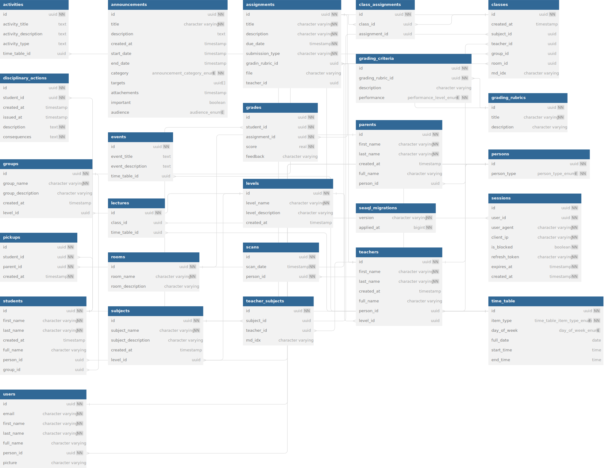

# RustThingy

School management api build using:

- actix-web as backend server
- postgres as database
- sea-orm and sea-migration to connect and run migrations

This is how the schema looks like:

You can also find the schema in the schema.sql file

Im using docker to run my database if you wanna use an other database you can here are the env variables that you need to run the project :

- DATABASE_URL
- OAUTH_CLIENT_ID
- OAUTH_SECRET
- REDIRECT_URL
- JWT_SECRET

## API

### Auth

- GET /auth/login > login using google account
- GET /auth/sessions/google > redirect route after google log in
- POST /auth/renew-access > renew access token > body: "{refresh_token: String}"

### Students

- POST /students/ > create new student > body: "{first_name: String, last_name: String, group_id?: Uuid, person_id?: Uuid}"
- GET /students/ > list all students > query params: "{page: u64, limit: u64, full_name?: String}"
- DELETE /students/{id} > delete a student
- PUT /students/{id} > update a student > body: "{first_name: String, last_name: String, group_id?: Uuid, person_id?: Uuid}"

### Parents

- POST /parents/ > create new parent > body: "{first_name: String, last_name: String, person_id?: Uuid}"
- GET /parents/ > list all parents > query params: "{page: u64, limit: u64, full_name?: String}"
- DELETE /parents/{id} > delete a parent
- PUT /parents/{id} > update a parent > body: "{first_name: String, last_name: String, person_id?: Uuid}"

### Teachers

- POST /teachers/ > create new teacher > body: "{first_name: String, last_name: String, person_id?: Uuid}"
- GET /teachers/ > list all teachers > query params: "{page: u64, limit: u64, full_name?: String}"
- DELETE /teachers/{id} > delete a teacher
- PUT /teachers/{id} > update a teacher > body: "{first_name: String, last_name: String, person_id?: Uuid}"
- POST /teachers/{id}/subject/{id} > create new subject to teacher (first id is for teacher and second id is for subject id)
- DELETE /teachers/subject/{id} > delete teacher subject id using id of the column in teacher_subjects table

### Levels

- POST /levels/ > create new level > body: "{name: String, description String}"
- GET /levels/ > list all levels > query params: "{page: u64, limit: u64, name?: String}"
- DELETE /levels/{id} > delete a level
- PUT /levels/{id} > update a level > body: "{name: String, description String}"

### Groups

- POST /groups/ > create new group > body: "{name: String, description String, level_id?: Uuid}"
- GET /groups/ > list all groups > query params: "{page: u64, limit: u64, name?: String}"
- DELETE /groups/{id} > delete a group
- PUT /groups/{id} > update a group > body: "{name: String, description String, level_id Option Uuid}"
- GET /groups/by-level-id/{id} > select groups by level

### Subjects

- POST /subjects/ > create new subject > body: "{name: String, description: String, level_id?: Uuid}"
- GET /subjects/ > list all subjects > query params: "{page: u64, limit: u64, name?: String}"
- DELETE /subjects/{id} > delete a subject
- PUT /subjects/{id} > update a subject > body: "{name: String, description: String, level_id?: Uuid}"
- GET /subjects/by-level-id/{id} > select subjects by level

### Classes

- POST /classes/ > create new class > body: "{subject_id?: Uuid, teacher_id?: Uuid, group_id?: Uuid, room_id?: Uuid}"
- GET /classes/ > list all classes > query params: "{page: u64, limit: u64, subject_id?: Uuid, teacher_id?: Uuid, group_id?: Uuid}"
- DELETE /classes/{id} > delete a class
- PUT /classes/{id} > update a class > body: "{subject_id?: Uuid, teacher_id?: Uuid, group_id?: Uuid, room_id?: Uuid}"

### Scans

- GET /scans/ > list all scans (students, parents, teachers) > body: "{person_id: Uuid}"
- POST /scans/ > create a scans > query params: "{ page: u64, limit: u64, scan_time_end?: String, scan_time_start?: String, full_name?: String, person_type?: String}"

### Attendance

- GET /attendance/ > list attendance of students > query params: "{ page: u64, limit: u64, scan_time_end?: String, scan_time_start?: String, full_name?: String, group_id?: Uuid}"

### Assignments

- POST /assignments/ > create new assignment > body: "{title: String, description: String, due_date: String, submission_type: String, gradin_rubric_id: Uuid, file?: String, teacher_id?: Uuid, subject_id?: Uuid}"
- GET /assignments/ > list all assignments > query params: "{page: u64, limit: u64, title?: String, due_date?: String, teacher_id?: Uuid}"
- DELETE /assignments/{id} > delete a assignment
- PUT /assignments/{id} > update a assignment > body: "{title: String,description: String,due_date: String,submission_type: String,gradin_rubric_id: Uuid,file: String,teacher_id: Uuid,subject_id: Uuid}"

### disciplinary actions

### grades

### grading rubrics

### rooms
